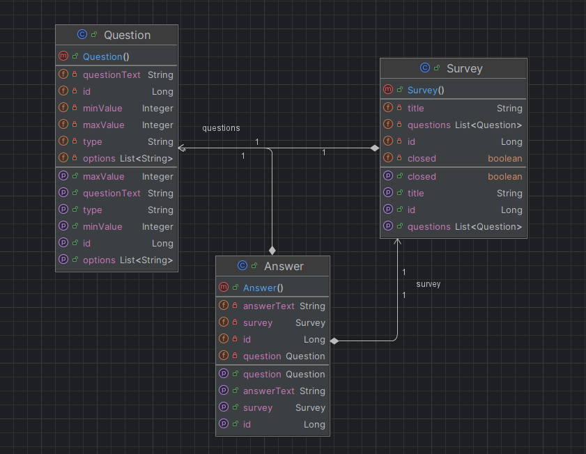

# Mini-SurveyMonkey
A SpringBoot app with functionality to create, edit, and review surveys.
Inspired by the SurveyMonkey platform.

### Relational Database Schema:

### UML Class Diagram:

### Progress:

For Milestone 1, we have implemented a functional SurveyMonkey application that allows users to create MCQ, numerical, and open-ended questions.
The application is deployed on Azure at this url: https://mini-survey-monkey-eyd6fhfyesf6ezay.canadacentral-01.azurewebsites.net/

### Contribution:

- **Sahadeo, Andrew #101186368:** Back-end, Front-end, Documentation
- **Mohamed Yonis, Mahad #101226808:** Back-end, Azure with CI, Documentation
- **Hassan, Muhammad #101181439:** Back-end, Database schema, Documentation
- **Evensen, Gabriel #101119814:** Testing, Documentation, Authentication, Debugging
- **Beldjehem, Tarik #101187965:** POM.xml with Dependencies, Back-end, Documentation

### Next Sprint Plan:

Create new issues based on Milestone 2 and assign them. Work on adding more functionality to the application. including more survey editing and cleaner frontend UI.
